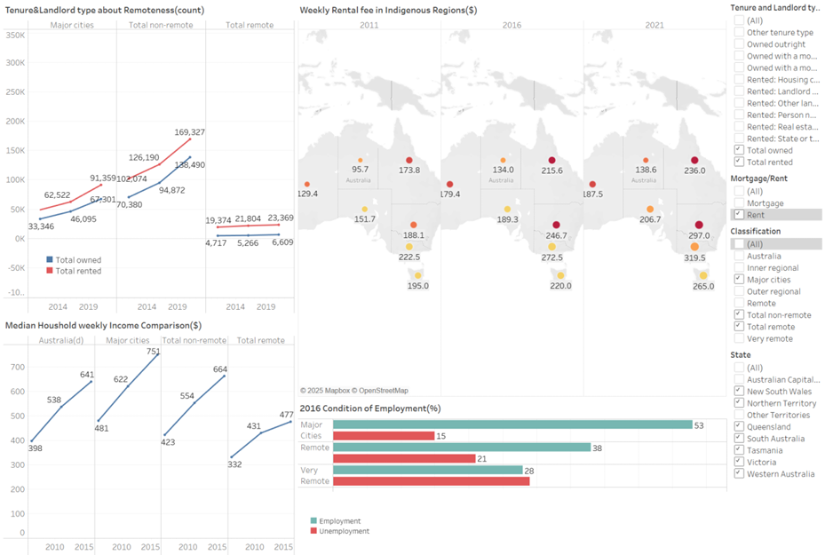
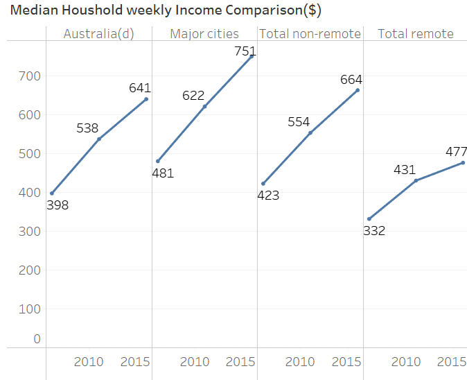
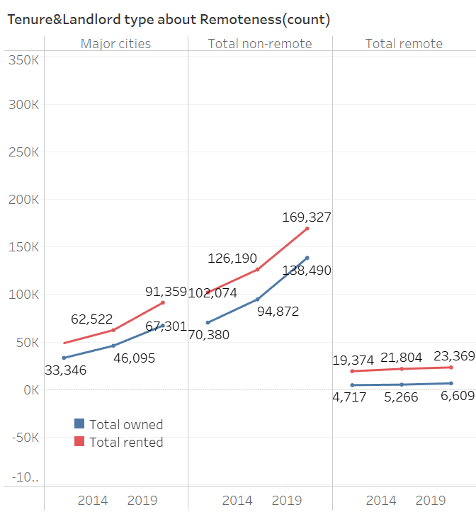
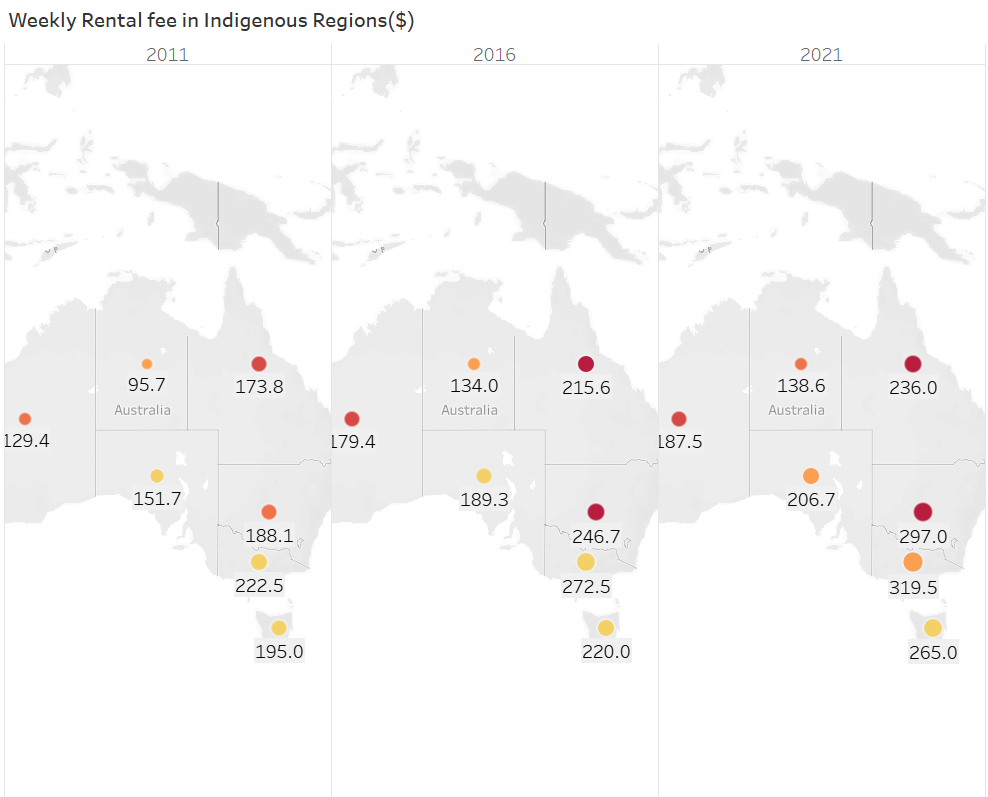
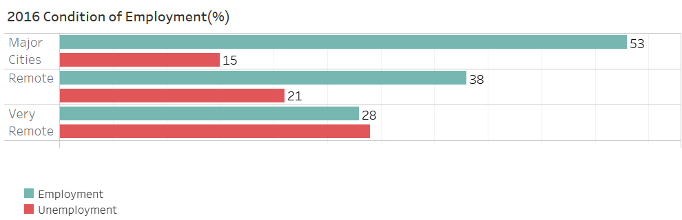

# Housing Conditions by Remoteness in Australia

## Overview

This project examines housing tenure, rental costs, household income and
employment indicators for Aboriginal and Torres Strait Islander households
across different remoteness classifications in Australia.

The dashboard was originally developed in Tableau using public data from the
Australian Bureau of Statistics (ABS). This repository presents the work as a
static business intelligence case study using dashboard images, descriptive
analysis and policy considerations.

The analysis is descriptive. It identifies patterns in the displayed data but
does not establish causal relationships between remoteness, income, employment
and housing outcomes.

## Project Questions

This project investigates the following questions:

- How do housing tenure patterns differ between remote and non-remote areas?
- How did weekly rental values change between 2016 and 2021?
- How does median household income differ by remoteness?
- How do employment indicators vary across remoteness categories?
- What housing pressures may require further policy investigation?

## Data Source

The project uses data from:

**Australian Bureau of Statistics**  
*Housing Statistics for Aboriginal and Torres Strait Islander Peoples, 2021*

https://www.abs.gov.au/statistics/people/aboriginal-and-torres-strait-islander-peoples/housing-statistics-aboriginal-and-torres-strait-islander-peoples/2021

The ABS publication provides downloadable tables covering:

- Housing tenure and landlord type
- Housing costs
- Household income
- Housing suitability and overcrowding
- Dwelling characteristics
- Remoteness and Indigenous Regions

The visualisations use data from different reference years between 2011 and
2021. Year and geographic classification should therefore be considered when
comparing results across charts.

## Tools

- Tableau - original dashboard development
- Microsoft Excel - data preparation and cleaning
- Australian Bureau of Statistics public datasets
- Data visualisation
- Descriptive analysis
- Public-sector data storytelling

## Dashboard Overview



The dashboard brings together four related perspectives:

1. Housing tenure by remoteness
2. Weekly rental values by Indigenous Region
3. Median household income by remoteness
4. Employment indicators by remoteness

These views should be interpreted together as indicators of housing and
socioeconomic conditions, rather than as evidence of a direct causal
relationship.

## Visual Analysis

### Median Household Weekly Income



Median weekly household income increased in both categories between 2011 and
2016:

| Remoteness category | 2011 | 2016 | Change |
|---|---:|---:|---:|
| Non-remote | $554 | $664 | +$110 |
| Remote | $431 | $477 | +$46 |

The displayed income gap increased from $123 per week in 2011 to $187 per week
in 2016. Remote households therefore recorded a smaller absolute increase over
the period shown.

These figures are descriptive and do not adjust for inflation, household size,
local living costs or differences within each remoteness category.

### Housing Tenure by Remoteness



The dashboard compares counts of rented and owned households in remote and
non-remote areas.

In the displayed data:

- Rented households outnumbered owned households in both categories.
- The difference between rented and owned households was particularly visible
  in the remote category.
- Both rented and owned household counts increased over the period shown.

Because the visualisation presents counts rather than population-adjusted
rates, values should not be used to compare prevalence between remote and
non-remote populations without appropriate denominators.

### Weekly Rental Values



Weekly rental values increased between 2016 and 2021 across all mapped regions.

The largest absolute increases in the displayed values occurred in New South
Wales and Victoria. Smaller increases were visible in Western Australia and
the Northern Territory.

The map supports geographic comparison, but the values should be interpreted
carefully because Indigenous Regions and Remoteness Areas are different
geographic classifications.

### Employment Indicators by Remoteness



The 2016 comparison shows that:

- The displayed employment percentage decreased as remoteness increased.
- The displayed unemployment percentage increased in remote and very remote
  areas.
- Major cities had the highest employment value among the categories shown.

The chart presents a descriptive comparison only. It does not control for age,
education, industry structure, labour-force participation or regional access
to employment opportunities.

## Key Findings

- Remote households had lower displayed median weekly income than non-remote
  households in both 2011 and 2016.
- Weekly rental values increased between 2016 and 2021 across the mapped
  Indigenous Regions.
- Renting was more common than ownership in the displayed tenure counts.
- Employment indicators were less favourable in more remote categories in the
  2016 comparison.
- Housing, income and employment patterns describe related socioeconomic
  pressures, but the dashboard does not establish that one directly causes
  another.

## Policy Considerations

The descriptive findings suggest several areas for further investigation:

1. **Culturally appropriate housing**

   Housing programs should be developed in consultation with Aboriginal and
   Torres Strait Islander communities and account for local household needs,
   cultural practices and geographic conditions.

2. **Housing affordability**

   Changes in rent should be assessed alongside household income, cost of
   living and the availability of social and community housing.

3. **Local infrastructure and employment**

   Investment in transport, essential services, training and local employment
   may help address broader socioeconomic pressures in remote communities.

4. **Updated and comparable monitoring**

   Future dashboards should use consistent years, geographic definitions and
   population-adjusted measures to support more reliable comparisons.

These are policy considerations based on descriptive patterns, not estimates
of the effect of a specific intervention.

## Limitations

- The visualisations use different reference years.
- Indigenous Regions and Remoteness Areas are not directly equivalent.
- Some charts use counts rather than population-adjusted rates.
- The analysis does not include statistical significance testing.
- Inflation and regional cost-of-living differences are not incorporated.
- The dashboard does not model causal relationships.
- ABS confidentiality adjustments may cause small differences between totals.
- The original interactive Tableau dashboard is not currently hosted, so this
  repository provides a static version.

## Repository Structure

```text
housing_dashboard/
|-- README.md
|-- data/
|   `-- abs_housing_data.xlsx
|-- images/
|   |-- graphs.png
|   |-- median_household_weekly_income.png
|   |-- remoteness_landloard_type.png
|   |-- weekly_rental_fee.png
|   `-- employment_condition.png
`-- LICENSE
```

The filename `remoteness_landloard_type.png` retains its original spelling so
that existing image links continue to work.

## Data Availability and Attribution

The project dataset was prepared from publicly available ABS housing tables.

Australian Bureau of Statistics data remains subject to the ABS licensing and
attribution requirements. The source data should be verified against the
official ABS publication before reuse because some tables may be revised after
publication.

## License

The original project materials in this repository are available under the MIT
License.

The MIT License does not replace or modify the licensing terms that apply to
Australian Bureau of Statistics data or other third-party materials.
